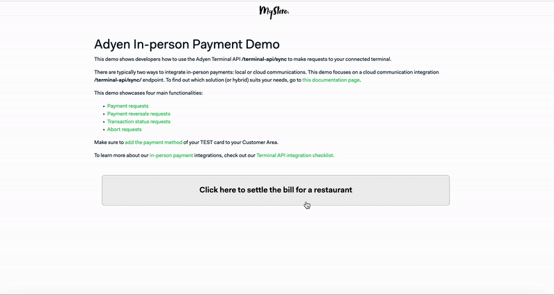
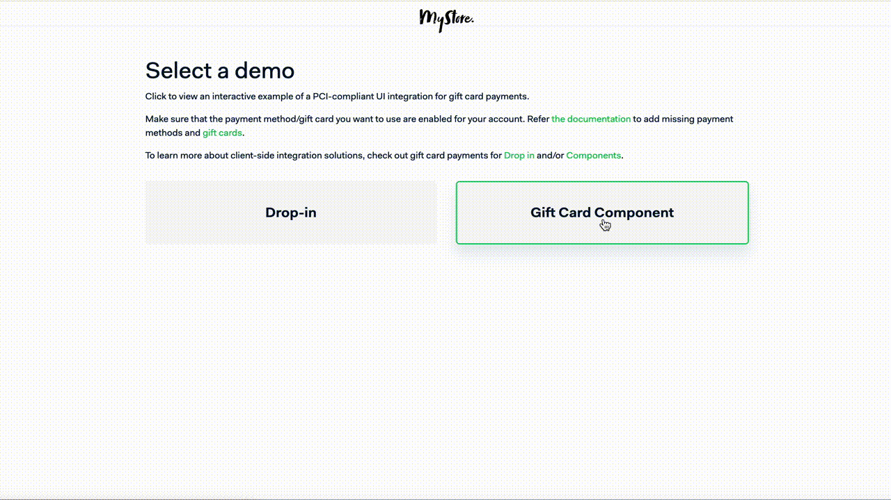
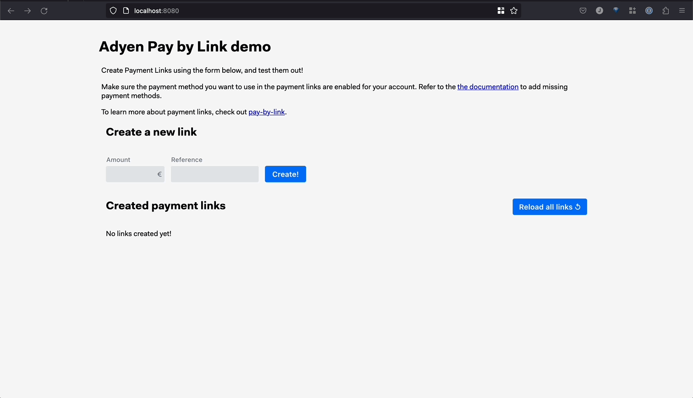
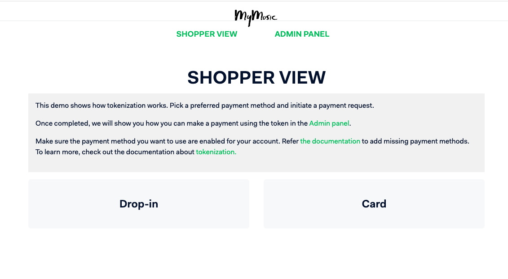
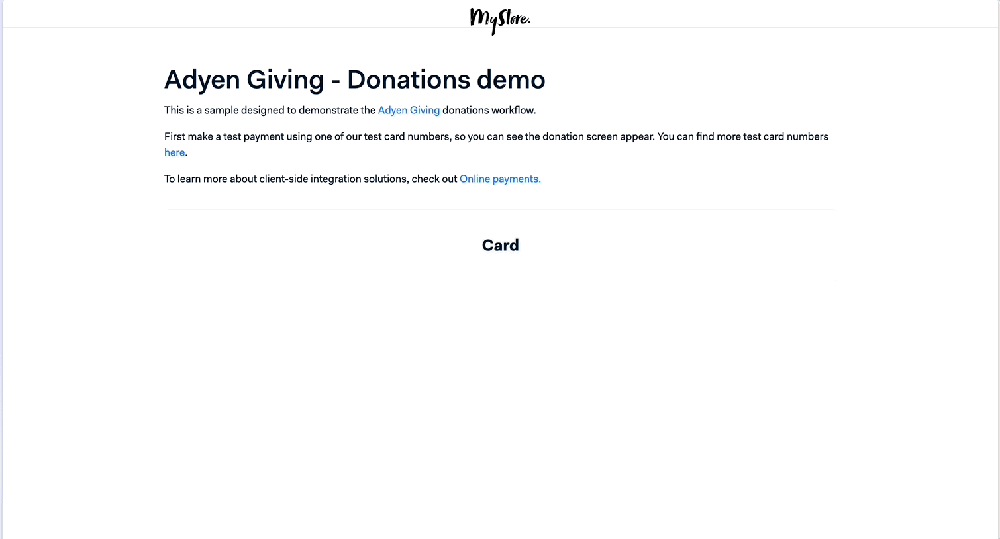

# Adyen Online Payment Integration Demos

This repository includes a collection of PCI-compliant UI integrations that show how to integrate with Adyen using different payment methods. 
The demos below leverages Adyen's API Library for Node.js ([GitHub](https://github.com/Adyen/adyen-node-api-library) | [Documentation](https://docs.adyen.com/development-resources/libraries)).

Get started by navigating to one of the supported demos below.

| Demos | Description | Details |
| --: | :-- | :-- |
| [`Checkout Example`](checkout-example) | E-commerce checkout flow with different payment methods. | [See below](#checkout-example) | 
| [`Advanced Checkout Example`](checkout-example-advanced) | E-commerce checkout flow with different payment methods, using the 3 steps flow. | [See below](#advanced-checkout-example) | 
| [`3DS2 Example`](3ds2-example) | Explore the Native and Redirect flows of 3D Secure 2 Authentication. | [See below](#3ds2-example) | 
| [`Authorisation Adjustment Example`](authorisation-adjustment-example) | Pre-authorise a payment, adjust the authorised amount, capture or reverse the payment. | [See below](#authorisation-adjustment-example) | 
| [`In-person Payments Example`](in-person-payments-example) | In-person payments using a POS terminal and the terminal-api/sync endpoint. | [See below](#in-person-payments-example) | 
| [`Gift Card Example`](giftcard-example) | Gift Cards checkout flow using partial orders. | [See below](#gift-card-example) | 
| [`Pay by Link Example`](paybylink-example) | Pay by Link flow. | [See below](#pay-by-link-example) | 
| [`Subscription Example`](subscription-example) | Subscription flow using Adyen tokenization. | [See below](#subscription-example) | 
| [`Giving Example`](giving-example) | Donation flow using Adyen Giving. | [See below](#giving-example) | 

## [Checkout Example](checkout-example)

  
[First time with Gitpod?](https://github.com/adyen-examples/.github/blob/main/pages/gitpod-get-started.md)

The [checkout example](checkout-example) repository includes examples of PCI-compliant UI integrations for online payments with Adyen.
Within this demo app, you'll find a simplified version of an e-commerce website, complete with commented code to highlight key features and concepts of Adyen's API.
Check out the underlying code to see how you can integrate Adyen to give your shoppers the option to pay with their preferred payment methods, all in a seamless checkout experience.

## [Advanced Checkout Example](checkout-example-advanced)

  

The [advanced checkout example](checkout-example-advanced) performs the same functionality as the [checkout example](checkout-example) but using the 3 stages of the Checkout API (Initiate, Submit, and Details) instead of the single `/sessions` endpoint.
See the [advanced integration flow](https://docs.adyen.com/online-payments/web-drop-in/additional-use-cases?tab=sessions_flow_advanced_flow_1) for more information.

## [3DS2 Example](3ds2-example)

The [3ds2 example](3ds2-example) shows developers how to integrate the Native and Redirect flows of 3DS2.
See the [3D Secure 2 Authentication](https://docs.adyen.com/online-payments/3d-secure/) for more information.

## [Authorisation Adjustment Example](authorisation-adjustment-example)

[First time with Gitpod?](https://github.com/adyen-examples/.github/blob/main/pages/gitpod-get-started.md)

The [`authorisation adjustment example`](authorisation-adjustment-example) repository includes adjust authorisation example for the following three use cases after a pre-authorised payment: incremental, decremental adjustments. Within this demo app, you'll find a simplified version of a hotel booking, where the shopper perform a booking and administrators can **[1] adjust** (increase/decrease) the payment amount, **[2] extend** the authorisation expiry date, **[3] capture** the final amount and/or **[4] reverse** (cancel or refund) an authorised payment

## [In-person Payments Example](in-person-payments-example)

[First time with Gitpod?](https://github.com/adyen-examples/.github/blob/main/pages/gitpod-get-started.md)

The [in-person payments example](in-person-payments-example) features an in-person payment [cloud terminal API](https://docs.adyen.com/point-of-sale/design-your-integration/choose-your-architecture/cloud/) integration. Within this demo app, you can make in-person payments using a terminal, initiate reversals (refunds) and check transaction statuses.

## [Gift Card Example](giftcard-example)

  
[First time with Gitpod?](https://github.com/adyen-examples/.github/blob/main/pages/gitpod-get-started.md)

The [gift card example](giftcard-example) repository includes a gift card flow during checkout. Within this demo app, you'll find a simplified version of an e-commerce website. The shopper can choose to use gift cards to complete their purchase or use their preferred payment method to pay the remaining amount.

## [Pay by Link Example](paybylink-example)

  
[First time with Gitpod?](https://github.com/adyen-examples/.github/blob/main/pages/gitpod-get-started.md)

The [`pay by link example`](paybylink-example) repository includes a Pay by Link flow. Within this demo app, you can create links by specifying the amount. The shopper can choose to accept the links and complete the payment.

## [Subscription Example](subscription-example)

  
[First time with Gitpod?](https://github.com/adyen-examples/.github/blob/main/pages/gitpod-get-started.md)

The [subscription example](subscription-example) repository includes a tokenization example for subscriptions. Within this demo app, you'll find a simplified version of a website that offers a music subscription service.
The shopper can purchase a subscription and administrators can manage the saved (tokenized) payment methods on a separate admin panel.
The panel allows admins to make payments on behalf of the shopper using this token.

## [Giving Example](giving-example)

  
[First time with Gitpod?](https://github.com/adyen-examples/.github/blob/main/pages/gitpod-get-started.md)

The [giving example](giving-example) repository includes a sample designed to demonstrate the Adyen Giving donations workflow.
First make a test payment using one of our test card numbers, so you can see the donation screen appear.

## Contributing

We commit all our new features directly into our GitHub repository. Feel free to request or suggest new features or code changes yourself as well!

Find out more in our [contributing](https://github.com/adyen-examples/.github/blob/main/CONTRIBUTING.md) guidelines.

## License

MIT license. For more information, see the **LICENSE** file.
