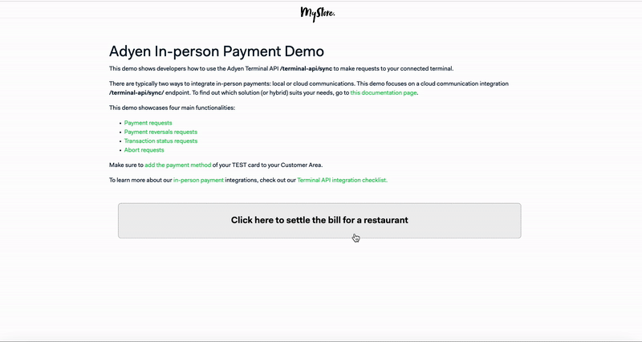

# Adyen [In-person Payment Demo](https://docs.adyen.com/point-of-sale/) Integration Demo

This demo shows developers how to use the Adyen [Cloud Terminal API](https://docs.adyen.com/point-of-sale/design-your-integration/choose-your-architecture/cloud/) `/terminal-api/sync` to make requests to your connected terminal.

The following implementations are included:
- [Payment requests](https://docs.adyen.com/point-of-sale/basic-tapi-integration/make-a-payment/)
- [Referenced refund requests](https://docs.adyen.com/point-of-sale/basic-tapi-integration/refund-payment/referenced/)
- [Cancel/abort requests](https://docs.adyen.com/point-of-sale/basic-tapi-integration/cancel-a-transaction/)
- [Transaction status requests](https://docs.adyen.com/point-of-sale/basic-tapi-integration/verify-transaction-status/)

There are typically two ways to integrate in-person payments: local or cloud communications.
To find out which solution (or hybrid) suits your needs, visit the following [documentation page](https://docs.adyen.com/point-of-sale/design-your-integration/choose-your-architecture/#choosing-between-cloud-and-local).

Make sure to [enable the payment method](https://docs.adyen.com/point-of-sale/what-we-support/payment-methods/#add-payment-methods-to-your-account) in your Customer Area environment.


This demo leverages Adyen's API Library for Node.js ([GitHub](https://github.com/Adyen/adyen-node-api-library) | [Docs](https://docs.adyen.com/development-resources/libraries#javascript)).

You can find the [Terminal API documentation](https://docs.adyen.com/point-of-sale/design-your-integration/terminal-api/terminal-api-reference/) here.



## Prerequisites
- A [terminal device](https://docs.adyen.com/point-of-sale/user-manuals/) and a [test card](https://docs.adyen.com/point-of-sale/testing-pos-payments/) from Adyen
- An Adyen account, learn how an Adyen account is structured in [our documentation](https://docs.adyen.com/point-of-sale/design-your-integration/determine-account-structure/)


## Flowchart


## Run integration on [Gitpod](https://gitpod.io/)
1. Open your [Adyen Test Account](https://ca-test.adyen.com/ca/ca/overview/default.shtml) and create a set of [API keys](https://docs.adyen.com/user-management/how-to-get-the-api-key).
    - [`ADYEN_API_KEY`](https://docs.adyen.com/user-management/how-to-get-the-api-key)
    - [`ADYEN_MERCHANT_ACCOUNT`](https://docs.adyen.com/account/account-structure)


2. Go to [Gitpod environment variables](https://gitpod.io/variables) and set the following variables with a scope of `*/*`:
   - [`ADYEN_API_KEY`](https://docs.adyen.com/user-management/how-to-get-the-api-key) - Your Adyen API Key.
   - [`ADYEN_MERCHANT_ACCOUNT`](https://docs.adyen.com/account/account-structure) - Merchant account that the terminal is assigned to.
   - `ADYEN_POS_POI_ID` - This is the **case-sensitive** unique ID (e.g. `V400m-123456789`) of your payment terminal for the NEXO Sale to POI protocol. 

> **Note**: If you'd like to check the connection of your terminal, you can do so in the Customer Area → `In-person payments` → `Terminals`.

This demo provides a simple webhook integration for receiving refund/reversal updates at `/api/webhooks/notifications`. For it to work, you need to provide a way for Adyen's servers to reach your running application on Gitpod and add a standard webhook in the Customer Area.

4. To receive notifications asynchronously, add a webhook: 
    - In the Customer Area go to `Developers` → `Webhooks` and add a new `Standard notification webhook`
    - Define username and password (Basic Authentication) to [protect your endpoint](https://docs.adyen.com/development-resources/webhooks/best-practices#security) - Basic authentication only guarantees that the notification was sent by Adyen, not that it wasn't modified during transmission
    - Generate the [HMAC Key](https://docs.adyen.com/development-resources/webhooks/verify-hmac-signatures) and set the `ADYEN_HMAC_KEY` in your [Gitpod Environment Variables](https://gitpod.io/variables) with a scope of `*/*` -  This key is used to [verify](https://docs.adyen.com/development-resources/webhooks/best-practices#security) whether the HMAC signature that is included in the notification, was sent by Adyen and not modified during transmission
    - For the URL, enter `https://gitpod.io` for now, we will need to update this webhook URL in step 6
    - Make sure the webhook is **Enabled** to send notifications


5. Click the button below to launch the application in Gitpod.

[](https://gitpod.io/#https://github.com/adyen-examples/adyen-node-api-library/tree/main/in-person-payments-example)


6. Update your webhook in the Customer Area with the public url that is generated by Gitpod
   - In the Customer Area, go to `Developers` → `Webhooks` → Select your `Webhook` that is created in step 4 → `Server Configuration`
   - Update the URL of your application/endpoint (e.g. `https://8080-myorg-myrepo-y8ad7pso0w5.ws-eu75.gitpod.io/api/webhooks/notifications/`
   - Hit `Apply` → `Save changes` and Gitpod should be able to receive notifications

> **Note** When exiting Gitpod a new URL is generated, make sure to **update the Webhook URL** in the Customer Area as described in the final step. 
> You can find more information about webhooks in [this detailed blog post](https://www.adyen.com/blog/Integrating-webhooks-notifications-with-Adyen-Checkout).


## Run integration on localhost using a proxy
You will need Node.js 18+. to run this application locally.

1. Clone this repository.

```
git clone https://github.com/adyen-examples/adyen-node-api-library.git
```

Navigate to the folder and install the dependencies:

```
npm install
```


2. Open your [Adyen Test Account](https://ca-test.adyen.com/ca/ca/overview/default.shtml) and create a set of [API keys](https://docs.adyen.com/user-management/how-to-get-the-api-key).
    - [`ADYEN_API_KEY`](https://docs.adyen.com/user-management/how-to-get-the-api-key)
    - [`ADYEN_MERCHANT_ACCOUNT`](https://docs.adyen.com/account/account-structure)


3. Set the [`ADYEN_POS_POI_ID`] as variable, which is the unique ID of your payment terminal for the NEXO Sale to POI protocol. **Format:** `[device model]-[serial number]`.

This demo provides a simple webhook integration for receiving refund/reversal updates at `/api/webhooks/notifications`. For it to work, you need to provide a way for Adyen's servers to reach your running application and add a standard webhook in the Customer Area. 
To expose this endpoint locally, we have highlighted two options in step 4 or 5. Choose one or consider alternative tunneling software.

4. Expose your localhost with tunneling software (i.e. ngrok).
    - Add `https://*.ngrok.io` to your allowed origins

If you use a tunneling service like ngrok, the webhook URL will be the generated URL (i.e. `https://c991-80-113-16-28.ngrok.io/api/webhooks/notifications/`).

```bash
  $ ngrok http 8080
  
  Session Status                online                                                                                           
  Account                       ############                                                                      
  Version                       #########                                                                                          
  Region                        United States (us)                                                                                 
  Forwarding                    http://c991-80-113-16-28.ngrok.io -> http://localhost:8080                                       
  Forwarding                    https://c991-80-113-16-28.ngrok.io -> http://localhost:8080           
```

5. To receive notifications asynchronously, add a webhook: 
    - In the Customer Area go to `Developers` → `Webhooks` and add a new `Standard notification webhook`
    - Define username and password (Basic Authentication) to [protect your endpoint](https://docs.adyen.com/development-resources/webhooks/best-practices#security) - Basic authentication only guarantees that the notification was sent by Adyen, not that it wasn't modified during transmission
    - Generate the [HMAC Key](https://docs.adyen.com/development-resources/webhooks/verify-hmac-signatures) - This key is used to [verify](https://docs.adyen.com/development-resources/webhooks/best-practices#security) whether the HMAC signature that is included in the notification, was sent by Adyen and not modified during transmission
    - See script below that allows you to easily set your environment variables
    - For the URL, enter `https://ngrok.io` for now - We will need to update this webhook URL in step 10
    - Make sure the webhook is **enabled** to send notifications

    
6. Set the following environment variables in your terminal environment: `ADYEN_API_KEY`, `ADYEN_CLIENT_KEY`, `ADYEN_MERCHANT_ACCOUNT` and `ADYEN_HMAC_KEY`. Note that some IDEs will have to be restarted for environment variables to be injected properly.

Create a `./.env` file with all required configuration

```
PORT=8080
ADYEN_API_KEY="your_API_key_here"
ADYEN_MERCHANT_ACCOUNT="your_merchant_account_here"
ADYEN_CLIENT_KEY="your_client_key_here"
ADYEN_HMAC_KEY="your_hmac_key_here"
```


8. Start the application and visit localhost.

```
npm run dev
```

9. Update your webhook in your Customer Area with the public url that is generated.
    - In the Customer Area go to `Developers` → `Webhooks` → Select your `Webhook` that is created in step 6 → `Server Configuration`
    - Update the URL of your application/endpoint (e.g. `https://c991-80-113-16-28.ngrok.io/api/webhooks/notifications/` or `https://xd1r2txt-5001.euw.devtunnels.ms`)
    - Hit `Apply` → `Save changes` and Gitpod should be able to receive notifications

> **Note** When exiting ngrok a new URL is generated, make sure to **update the Webhook URL** in the Customer Area as described in the final step. 
> You can find more information about webhooks in [this detailed blog post](https://www.adyen.com/blog/Integrating-webhooks-notifications-with-Adyen-Checkout).


## Usage
1. Select the cloud terminal api integration
2. Select a table
3. Select pay to perform a payment
4. Complete the instructions on your terminal
5. Select reversal to refund the payment
6. If webhooks are set up, listen for the notifications to update the payment status
